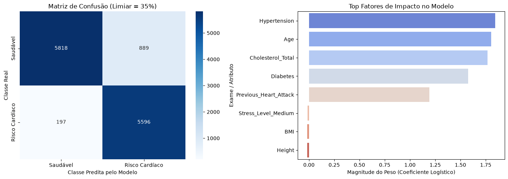

# 🫀 Estratificação de Risco Cardíaco com Rede Neural *From Scratch*

## 📌 Visão Geral do Projeto
Este projeto implementa uma rede neural binária desenvolvida inteiramente **"from scratch"** (do zero) utilizando apenas a biblioteca **NumPy** para operações matriciais. O objetivo principal é a triagem preventiva de risco de doença cardíaca em um conjunto de dados de **50.000 registros médicos**, priorizando a sensibilidade diagnóstica (**Recall**) e a interpretabilidade dos exames para tomada de decisão clínica.

---

## 🛠️ Destaques Técnicos & Metodologia

- **Algoritmo Base:** Perceptron / Regressão Logística com otimização por **Gradiente Descendente** e função de perda **Log-Loss (Binary Cross-Entropy)**.
- **Função de Ativação:** Sigmoide com tratamento de estabilidade numérica via `np.clip`.
- **Pré-processamento Robusto:**
  - Tratamento dinâmico de valores nulos (`NaN`).
  - Codificação de variáveis categóricas via *One-Hot Encoding*.
  - Padronização de escala de exames clínicos utilizando `StandardScaler`.
- **Calibração de Limiar Clínico:** Otimização do ponto de corte para **0.35** (em vez do padrão 0.50), reduzindo significativamente os Falsos Negativos em ambiente médico.

---

## 📊 Resultados e Métricas Obtidas

| Métrica | Valor | Relevância Médica |
| :--- | :---: | :--- |
| **ROC-AUC** | **0.9833** | Excelente capacidade de separação entre pacientes saudáveis e em risco. |
| **Recall (Sensibilidade)** | **97%** | Alta taxa de identificação de pacientes realmente doentes. |
| **Acurácia Geral** | **91%** | Desempenho consistente em 12.500 casos de teste. |

### Matriz de Confusão (Conjunto de Teste)
- **Verdadeiros Positivos (Doentes Identificados):** 5.596
- **Falsos Negativos (Risco Não Detectado):** Apenas 197 casos (minimizados estrategicamente pelo limiar de 35%).
  
---

## 🧬 Interpretação dos Exames (Explainability)
Através da extração dos coeficientes (pesos $\mathbf{w}$) aprendidos pelo modelo, identificaram-se os principais fatores de risco:
1. **Hypertension (+1.8450):** Fator isolado de maior impacto positivo no diagnóstico de risco.
2. **Age (+1.8039):** Idade avançada aumenta diretamente a probabilidade calculada.
3. **Cholesterol_Total (+1.7665):** Colesterol elevado atua como forte preditor de risco.

---

## 🚀 Como Executar o Projeto

1. Clone o repositório:
   git clone https://github.com/taymarinho700/estratificacao-risco-cardiaco-neural-network.git
